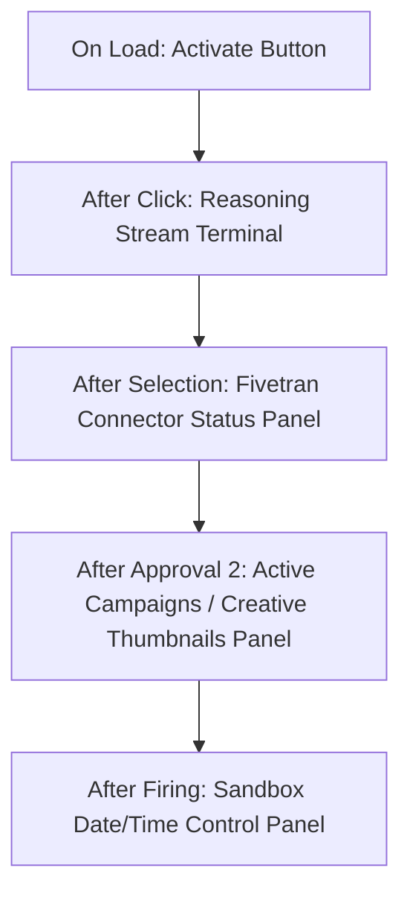

# PULSE Stage 4, 5, & 6 Context Document

This document outlines the architecture, flow, systems, and implementation details for Stage 4 (Approvals), Stage 5 (Delivery), and Stage 6 (Resolution) of the PULSE Campaign Orchestration Engine.

---

## 1. Confirmed Working Event Flow

During a simulation run (triggered by jumping directly to Stage 4 via `DEMO_STAGE_4 = True`), the following sequence of events is emitted from `agents/orchestrator.py` in the `_run_demo_stage_4()` method:

| Order | Event Type | Key Fields | File/Receiver | Visual & Behavioral Effect in Frontend |
| :--- | :--- | :--- | :--- | :--- |
| **1** | Reasoning Log | `{"type": "thinking"}` | SSE (`dashboard.js`) | Appends log line with thinking dots to the reasoning terminal. |
| **2** | `awaiting_approval_2` | `"creatives"`, `"tenants"` | SSE (`dashboard.js`) | Pauses the simulation. Displays **Banner 2 (creatives approval)** and slides down the **Active Campaigns** panel with ad thumbnails. |
| **3** | `pending_approval` | `"tenant_ids"` | WebSocket (`dashboard.js` & `simulation.js`) | Stops active ad cycling. Runs the local acceptance sequence on the dashboard. In the 3D canvas, it triggers a **RED pulsing glow** on the 5 target stores with floating "Awaiting Manager Approval" signs above them and sweeps the camera. |
| **4** | `loyalty_notifications` | `"notifications"`, `"tenants"` | WebSocket (`dashboard.js`) | Slides down the loyalty notifications list in the Active Campaigns panel, flying in mock push notifications. |
| **5** | `campaign_fired` | `"tenant_ids"`, `"creatives"` | WebSocket (`dashboard.js` & `simulation.js`) | Triggers the active campaign state in the simulation (stores turn **CYAN** with a cyan glow) and starts the **Ad Cycling loop** across all screens. Increments the dashboard active campaigns counter and opens the **Sandbox panel**. |
| **6** | `screen_activated` | `"screen_id"`, `"creative_url"` | WebSocket (`dashboard.js` & `simulation.js`) | Updates the texture on a specific screen to the tenant's creative image asset path. |
| **7** | `campaign_resolved` | `"tenant_ids"`, `"revenue_lift"` | WebSocket (`dashboard.js`) | Triggers the campaign resolution stats and animates the revenue counter in the dashboard header. |

---

## 2. WebSocket Routing (Critical)

All background orchestrator events are routed through `run_orchestration_loop()` in `api/routes/agents.py`. 

### Routing Logic
```python
async def run_orchestration_loop(goal: str):
    from api.websocket import manager
    
    orchestrator = OrchestratorAgent()
    local_queue = asyncio.Queue()
    
    # Run the orchestrator run_goal task
    task = asyncio.create_task(orchestrator.run_goal(goal, local_queue))
    
    while not task.done() or not local_queue.empty():
        try:
            event = await asyncio.wait_for(local_queue.get(), timeout=0.1)
            # Send to SSE stream (reasoning panel)
            await broadcast_agent_step(event)
            
            # ALSO send to WebSocket for simulation events
            ws_types = [
                "campaign_fired", "fivetran_sync", "investigating",
                "tenant_excluded", "screen_activated", "campaign_resolved",
                "awaiting_approval_1", "awaiting_approval_2",
                "pending_approval",
                "loyalty_notifications", "footfall_update"
            ]
            if event.get("type") in ws_types:
                await manager.broadcast(event)
        except asyncio.TimeoutError:
            pass
        await asyncio.sleep(0.01)
        
    await task
```

> [!IMPORTANT]
> The `ws_types` array determines which backend events are forwarded to the 3D simulation via the WebSocket connection. `pending_approval` must be explicitly included in this array for the red store glow animations to trigger.

---

## 3. Simulation Event Handlers (`simulation.js`)

The `handleEvent()` entry point in `frontend/js/simulation.js` processes these events:

### `pending_approval`
```javascript
            case "pending_approval":
                console.log('[PULSE] pending_approval received:', msg.tenant_ids);
                this.stopAdCycling();
                const pendingIds = msg.tenant_ids || [];
                
                // Clear previous highlights
                this.highlightLayer.removeAllMeshes();
                if (typeof this.clearApprovalAnimations === 'function') {
                    this.clearApprovalAnimations();
                }
                
                pendingIds.forEach(tenantId => {
                    const key = tenantId.toUpperCase();
                    const store = this.stores[key] || this.stores[tenantId];
                    if (!store) return;
                    
                    // Reset store highlights/emissive colors to default first
                    ...
                    // Pulse red emissive on child meshes
                    const pulseInterval = setInterval(() => {
                        ...
                    }, 40);
                    store._approvalPulseInterval = pulseInterval;
                    
                    // Create floating Billboard banner above the store
                    const signPlane = BABYLON.MeshBuilder.CreatePlane(`approvalSign_${key}`, { width: 10, height: 2.5 }, this.scene);
                    ...
                    store._approvalSign = signPlane;
                    
                    // 5 second sequence
                    setTimeout(() => {
                        clearInterval(store._approvalPulseInterval);
                        // Show green sign and transition to campaign_active
                        ...
                    }, 5000);
                });
                break;
```

### `campaign_fired`
```javascript
            case "campaign_fired":
                console.log('[PULSE] campaign_fired received:', msg);
                const cData = msg.data || {};
                const tenantIds = msg.tenant_ids || cData.tenant_ids || [];
                const creatives = msg.creatives || cData.creatives || [];
                
                if (tenantIds) {
                    tenantIds.forEach(id => {
                        const mappedId = id.toUpperCase();
                        const store = this.stores[mappedId];
                        if (store && store._approvalPulseInterval) {
                            // Defer state transition if approval is currently running
                            store._pendingCampaignActive = true;
                        } else {
                            this.setStoreState(mappedId, 'campaign_active');
                        }
                    });
                }
                if (creatives && Array.isArray(creatives) && creatives.length > 0) {
                    this.startAdCycling(creatives);
                }
                break;
```

### `screen_activated`
```javascript
            case "screen_activated":
                console.log('[PULSE] screen_activated:', msg.screen_id, msg.creative_url);
                if (msg.screen_id && msg.creative_url) {
                    this.updateAdScreen(msg.screen_id, msg.creative_url);
                }
                break;
```

### `investigating`
```javascript
            case "investigating":
                const investigatingIds = (msg.data && msg.data.tenant_ids) || msg.tenant_ids || [];
                investigatingIds.forEach(id => {
                    const mappedId = id.toUpperCase();
                    if (this.stores[mappedId]) {
                        this.setStoreState(mappedId, "investigating");
                    }
                });
                break;
```

> [!NOTE]
> There is **no** explicit `tenant_excluded` event handler case in the `simulation.js` `handleEvent` switch block; it is handled implicitly on the backend or in the dashboard logic.

---

## 4. Ad Screen System

### Registration and Storage
All standard screens from `mall_layout.json` are registered in the `adScreens` map during `buildAdScreens()`:
```javascript
this.adScreens[screenId] = plane;
```
The custom parking screen (`AD-PRK-NEW`) is rebuilt manually in `_buildParkingScreen()` and is stored in the same lookup.

### Currently Registered Screens
1. `AD-ENT-N1` (Entrance North Left - Floor 1)
2. `AD-ENT-N2` (Entrance North Right - Floor 1)
3. `AD-ENT-S1` (Entrance South Left - Floor 1)
4. `AD-ENT-S2` (Entrance South Right - Floor 1)
5. `AD-FL2-NW` (Second Floor North-West)
6. `AD-FL2-NE` (Second Floor North-East)
7. `AD-FL2-SW` (Second Floor South-West)
8. `AD-FL2-SE` (Second Floor South-East)
9. `AD-PRK-NEW` (East Parking Lot - Exterior)

### Image Loading and Scaling (`updateAdScreen`)
Images are fetched and rendered inside `img.onload` to ensure they fit correctly on the 1024x576 canvas without cropping (contain mode):
```javascript
const fitScale = Math.min(1024 / imgW, 576 / imgH);
const destW = Math.floor(imgW * fitScale);
const destH = Math.floor(imgH * fitScale);
const destX = Math.floor((1024 - destW) / 2);
const destY = Math.floor((576 - destH) / 2);

ctx.fillStyle = '#000000';
ctx.fillRect(0, 0, 1024, 576);
ctx.drawImage(img, 0, 0, imgW, imgH, destX, destY, destW, destH);
this._applyCanvasToScreen(screen, screenId, canvas);
```

### Texture Application (`_applyCanvasToScreen`)
Applies the offscreen canvas to the WebGL texture using correct mirror settings (`uScale`):
```javascript
_applyCanvasToScreen(screen, screenId, canvas) {
    let dynTex = screen.texture;
    if (!dynTex) {
        ...
        dynTex.uScale = -1; // Default mirror correction for standard screens
    }
    const texCtx = dynTex.getContext();
    texCtx.clearRect(0, 0, texSize.width, texSize.height);
    texCtx.drawImage(canvas, 0, 0, canvas.width, canvas.height, 0, 0, texSize.width, texSize.height);
    dynTex.update(true);
}
```

### Horizontal Mirroring (`uScale`) Differences
* **Standard Screens:** Face various interior directions and use `dynTex.uScale = -1` (flipped horizontally) inside `_applyCanvasToScreen` to compensate for coordinate mirroring.
* **Exterior Screen (`AD-PRK-NEW`):** Explicitly overrides and uses `dynTex.uScale = 1` inside `_buildParkingScreen()` to keep text readable without reflection.

### Ad Cycling (`startAdCycling`)
Starts a `setTimeout` chain that sweeps through the active campaign creatives sequentially:
```javascript
const showNext = () => {
    if (!this.activeCampaignCreatives || this.activeCampaignCreatives.length === 0) return;
    const creative = this.activeCampaignCreatives[this.adCycleIndex];
    const url = creative.url || `/assets/premade_ads/${creative.tenant_id}.html`;
    
    const rank = creative.rank || (this.adCycleIndex + 1);
    const duration = rank <= 2 ? 6000 : 3000; // Rank 1-2: 6s | Rank 3-5: 3s
    
    Object.keys(this.adScreens).forEach(screenId => {
        this.updateAdScreen(screenId, url);
    });
    
    this.adCycleIndex = (this.adCycleIndex + 1) % this.activeCampaignCreatives.length;
    this.adCycleInterval = setTimeout(showNext, duration);
};
```

---

## 5. Red Glow System

### Child Mesh Highlight logic
Highlighting the parent box mesh along with children causes GPU conflict and flickering in the Babylon.js HighlightLayer. Thus, the system grabs all **children meshes only** and adds them:
```javascript
const children = store.mesh.getChildMeshes(false);
children.forEach(c => this.highlightLayer.addMesh(c, new BABYLON.Color3(1, 0, 0)));
```
The three child mesh structures per store are:
1. `storeGlass_S##` (The glass storefront facade)
2. `counter_S##` (The interior retail display/counter block)
3. `storeSign_S##` (The sign backing plate above the door)

### The 5-Second Timer Sequence
1. When `pending_approval` event is captured, `setInterval` pulses the emissive color of the child meshes from neutral to deep red every 40ms.
2. An HTML-drawn DynamicTexture billboard is spawned at `(storeX, storeY + 8, storeZ)` reading `⏳ Awaiting Manager Approval`.
3. After **5 seconds**, the pulse interval is cleared, red highlights are removed, and the billboard is redrawn to show green `✓ Manager Approved!` text.
4. After **1 additional second** (total 6 seconds), the sign is disposed, and the store is transitioned to `'campaign_active'` (solid cyan emissive color and cyan highlight glow).

### Timing Delay and Synchronization
To ensure synchronization with the simulation's 5s pulsing sequence, the orchestrator on the backend enforces explicit sleep timers:
* Backend sends `pending_approval`.
* Backend sleeps for **5 seconds** (matching the red pulse).
* Backend sends `loyalty_notifications`.
* Backend sleeps for **7 seconds** (allowing local approval transitions to finalize).
* Backend sends `campaign_fired` (and screens transition to campaign ads).

### The `_approvalHandled` Flag
Prevents race conditions where `campaign_fired` and `pending_approval` timeouts compete to update the store state. It flags when the client side has successfully completed the manager sign-off sequence.

---

## 6. Creative URL Format

* **Generated Campaign Images:** `/assets/creatives/{tenant_id}_ad.png`
* **Premade Fallback Ads:** `/assets/premade_ads/{tenant_id}.html`

### Dashboard Rendering Choice (`renderThumbnails`)
The dashboard decides whether to draw an image or render an iframe using a simple extension regex check:
```javascript
const isRealImage = url && (
    url.endsWith('.png') || 
    url.endsWith('.jpg') || 
    url.endsWith('.webp')
);
if (isRealImage) {
    // Renders  tag
    // Falls back to /assets/premade_ads/{tenantId}.html on img.onerror
} else {
    // Renders <iframe> tag
}
```

### Screen Parser (`updateAdScreen`)
Regex parsers extract the tenant ID format in both formats:
* **HTML checks:** `creativeUrl.match(/\/([A-Z]\d+)\.html/)`
* **Image checks:** `creativeUrl.match(/\/([A-Z]\d+)[_.]/)`

---

## 7. Known Issues & Gotchas

* **`focusStore` is not a function:** The dashboard calls `window.pulseSimulation.focusStore()` inside some components. However, the simulation API exposes it as `focusOnStoreForCreative(tenantId, duration)` and `focusStore` is not defined, leading to console errors if called directly without parameters.
* **Double `campaign_fired` trigger:** The dashboard listens for events via both SSE and WebSockets. Because both channels receive the `"campaign_fired"` type, code inside this handler runs twice unless deduped.
* **`AD-PRK-NEW` Mirroring:** It is rotated such that standard `uScale = -1` mirrors it incorrectly. It must always use `uScale = 1`.
* **DynamicTexture API Warning:** `markAsDirty()` is not a standard method on Babylon's `DynamicTexture`. Calling it results in runtime failures. The correct approach is using `update(true)` to push context changes.

---

## 8. Hardcoded Demo Tenants (Stage 4)

The demo loop runs with these 5 hardcoded tenants:

| Rank | Tenant ID | Brand Name | Category | Zone | Screens |
| :--- | :--- | :--- | :--- | :--- | :--- |
| **1** | S17 | Aurel | JEWELRY | Z6 | `AD-FL2-NE`, `AD-FL2-SE` |
| **2** | S07 | Apex Tech | ELECTRONICS | Z3 | `AD-ENT-N2`, `AD-FL2-NE`, `AD-PRK-NEW` |
| **3** | S22 | Brewpoint Coffee | FOOD & BEVERAGE | Z7 | `AD-FL2-SW`, `AD-FL2-SE` |
| **4** | S06 | Lumiere Beauty | BEAUTY | Z2 | `AD-ENT-N1`, `AD-FL2-NW` |
| **5** | S11 | Solene | FASHION | Z4 | `AD-ENT-S1`, `AD-ENT-S2` |

---

## 9. Dashboard Panel Sequence

The right sidebar column panels stack dynamically in response to state transitions:


